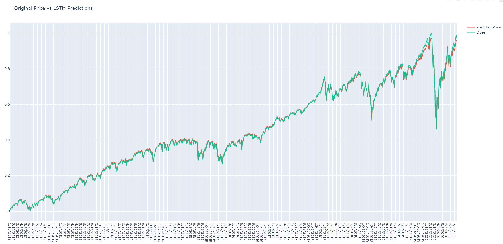

# Using LSTM from tensorflow to Predict Stock Prices

## Description
Simple code sample using tensorflow to predict stock prices over a given period of time. Likely a good base for expanding by adding more variables to increase
resolution and accuracy. 

